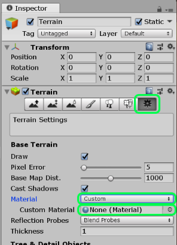
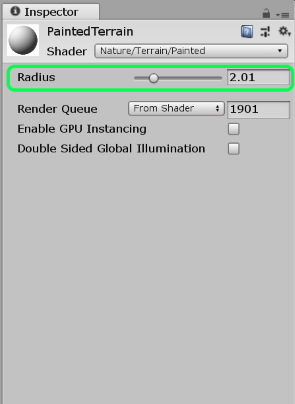

# Painted Terrain Shader

This shader replaces the default Unity terrain shader and applies an adjustable painted look to the textures.

## Usage

To use this shader on a `Terrain` component, first select the object in Unity.

Click on the `Terrain Settings` cog button. Change the Material entry to `Custom` and then drag the `PaintedTerrain` material into the `Custom Material` slot.

## Adjusting the effect

To adjust the paint effect, use the `Range` slider in the `Material Settings` for the `PaintedTerrain` material.

## Performance warning

This shader performs multiple texture samples over the 4 terrain textures. The performance will not be particularly optimal. You might improve performance by removing unused textures from the `PaintedMix` function.

Unlike the built in shader, this version doesn't support texture normals or textures beyond the first 4.

## Attributions

The original source of the paint shader is unknown.

The method used to adapt the terrain shader is based on the following blog entry: https://alastaira.wordpress.com/2013/12/07/custom-unity-terrain-material-shaders/

The tile-able textures used in the example are from: https://texturehaven.com

